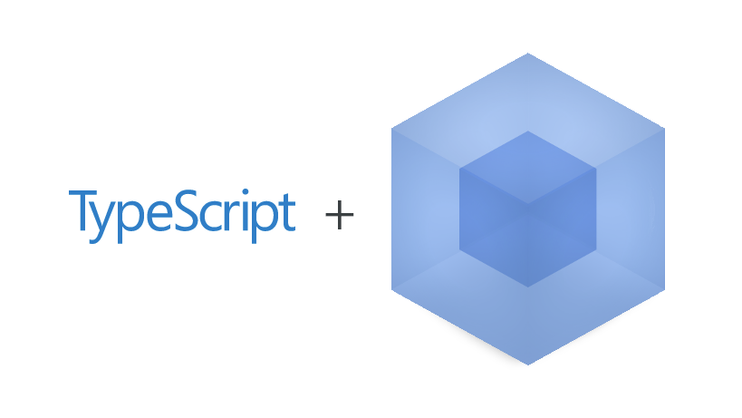

# test-typescript-webpack

:ledger: Test application with `TypeScript` and `Webpack`.



## Development

```bash
npm run build # single mode
# or
npm run watch # observe and recompile
npm start
```

## Production

```bash
npm run build:prod
npm start
```

## License

[The MIT License](http://piecioshka.mit-license.org) @ 2015
